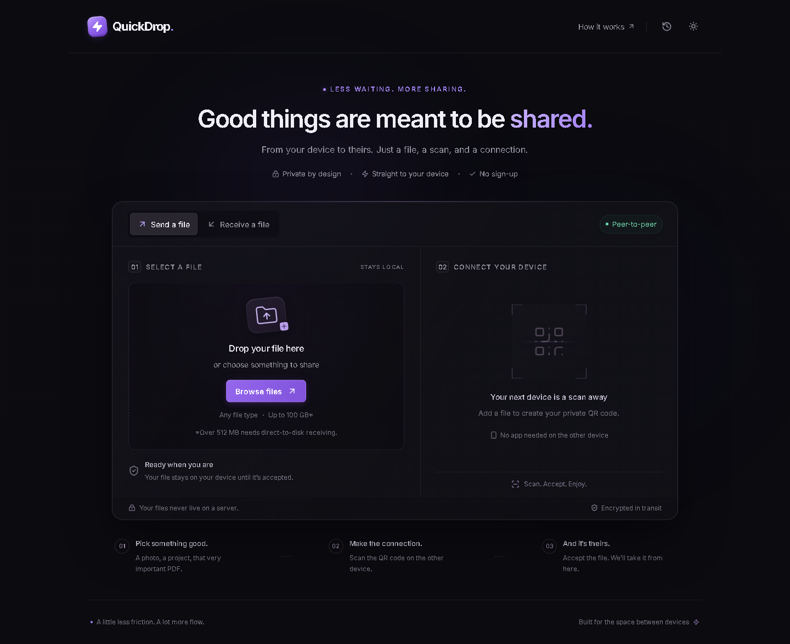

# QuickDrop

**Choose a file. Scan a code. Send it directly between browsers.**

QuickDrop is a QR-based peer-to-peer file transfer app with encrypted WebRTC transport, receiver consent, live progress, and direct-to-disk saving for large files. No account or cloud file upload is required.



File contents and metadata travel through the WebRTC data channel. The separate signaling service relays only SDP/ICE connection messages and keeps ephemeral session state in memory. An optional TURN server can relay encrypted traffic when a direct connection is unavailable.

### At a glance

| Feature     | What you get                                                                            |
| ----------- | --------------------------------------------------------------------------------------- |
| Share       | QR code or invitation link, with explicit receiver acceptance                           |
| Transfer    | Ordered chunks, live speed and ETA, cancellation, and final receipt                     |
| Large files | Direct-to-disk streaming with a bounded write queue                                     |
| Interface   | Responsive layout, dark/light themes, and local transfer history                        |
| Validation  | 43 unit/integration tests and 17 browser tests, including an opt-in real 2 GiB transfer |

The configured file limit is **100 GiB**; the largest end-to-end transfer verified here is **2 GiB + 37 bytes**, with every saved byte checked. Receiving above **512 MiB** requires a browser with direct-to-disk support. See [Multi-GB transfers](#multi-gb-transfers) for the limits.

Built with Vite, React, Tailwind CSS, Framer Motion, `qrcode.react`, `simple-peer`, `uuid`, Node.js, and `ws`.

[Quick start](#run-locally) · [Features](#included) · [Deployment](#deployment-vercel--render) · [Privacy](#connectivity-and-privacy-boundaries) · [Tests](#validation) · [Troubleshooting](#troubleshooting)

## Run locally

Use Node.js 22.12+ and npm. From the repository root:

```sh
git clone https://github.com/rishirana463-hub/QuickDrop.git
cd QuickDrop
npm ci
npm run dev
```

Open [QuickDrop on localhost](http://localhost:5173). This runs the frontend on port 5173 and signaling on port 3001. Vite proxies `/signal` to the signaling service; no environment setup is necessary for local development. The health endpoint is [localhost:3001/health](http://localhost:3001/health).

Select a file, copy its transfer link, and open it in a second browser/tab. The second device must accept before any file bytes are sent. To try the receiver entry screen, use **Receive a file** and paste a transfer link.

**Phone testing needs a reachable HTTPS deployment.** A `localhost` QR code points to the scanning phone itself, not your computer. Use the deployment steps below or an HTTPS development tunnel forwarding the frontend (including its `/signal` WebSocket route). Add that exact HTTPS origin to `server/.env`'s `ALLOWED_ORIGINS`, restart the signaling service, and open QuickDrop at the tunnel URL on the sender. Do not rely on plain HTTP LAN addresses for mobile testing.

To keep using the sender at localhost while scanning on a phone, also set `VITE_PUBLIC_APP_URL` to the tunnel's HTTPS origin in `client/.env.local`, rebuild with `npm run build`, and restart the preview server. Vite permits that configured hostname explicitly. With a free ngrok tunnel, tap **Visit Site** on its one-time introduction screen. Keep the tunnel and app processes running; if its address changes, update both environment files and rebuild. The QR panel labels unconfigured localhost links as local-only instead of suggesting that a phone can reach them.

## Included

- Drag and drop or browse for a single file up to 100 GiB, with filename, type, and size. Receiving over 512 MiB requires direct-to-disk support.
- Unique UUID session links, QR codes, copy-link fallback, and five-minute unused invitation expiry.
- Receiver file preview and explicit Accept/Decline before any file bytes are sent.
- Ordered 32 KiB file slices with data-channel backpressure. Disk transfers also use a 1 MiB acknowledged window: the sender waits for completed disk writes before sending the next window. Neither device assembles a large file in memory.
- Byte-based progress, average transfer speed, and ETA on both devices.
- Receiver verifies the final byte count and acknowledges receipt before sender success.
- Direct-to-disk saving on supported browsers. The receiver chooses the destination before file bytes are sent, and success is reported only after the file stream closes successfully. Files up to 512 MiB also support the automatic Blob download flow, a visible download link, and native device-save options when available.
- Cancellation, invalid/expired sessions, connection failure and inactivity handling.
- Dark/light modes, mouse tilt, glass panels, animated progress and success, reduced-motion support, responsive layouts.
- Local history of the last 20 completed transfers, with a clear-history control. Only metadata is kept in browser storage.

## Deployment: Vercel + Render

The repository contains deployment configuration; no remote services or accounts are provisioned by running it locally.

### 1. Signaling on Render

Create a Web Service from this repository, or import the included `render.yaml` Blueprint. Use the repository root as the service root:

| Setting           | Value                                                                     |
| ----------------- | ------------------------------------------------------------------------- |
| Runtime           | Node 22.12+                                                               |
| Build command     | `npm ci --omit=dev --workspace server`                                    |
| Start command     | `npm start --workspace server`                                            |
| Health check      | `/health`                                                                 |
| Instances         | **1**, because sessions are process-local                                 |
| `ALLOWED_ORIGINS` | Exact HTTPS frontend origin(s), comma separated, without trailing slashes |

Render supplies `PORT`. Its external HTTPS/WSS endpoint terminates TLS; the Node server listens on the provided port internally. Use `wss://YOUR-SERVICE.onrender.com/signal` in the frontend. See [Render's WebSocket documentation](https://render.com/docs/websocket).

### 2. Frontend on Vercel

Import the same repository with **Root Directory = `client`**, **Framework = Vite**, **Build = `npm run build`**, and **Output Directory = `dist`**. Retain access to files outside the root directory for the root npm workspace lockfile. Vercel's default workspace-aware install uses the root lockfile; if configuring installation manually, run `npm ci` from the repository root.

Set these build environment variables before deploying:

```dotenv
VITE_SIGNALING_URL=wss://YOUR-SERVICE.onrender.com/signal
# Optional: defaults to the browser's origin, normally leave unset.
VITE_PUBLIC_APP_URL=https://YOUR-APP.vercel.app
```

Set Render's `ALLOWED_ORIGINS` to the exact Vercel origin. When a preview/custom domain changes, add its exact origin explicitly. The included `client/vercel.json` rewrites deep links so `/receive/{sessionId}` opens the React app. Follow [Vercel's Vite documentation](https://vercel.com/docs/frameworks/frontend/vite) for project setup and SPA routing.

Changing `VITE_` values requires rebuilding the frontend. If `VITE_PUBLIC_APP_URL` is set, it must point to the same app version/signaling service so QR links join the correct session.

### 3. Verify the deployed pair

Open the sender at its public HTTPS URL. Select a small file and scan its code from a phone. Check the filename, accept it, compare the downloaded contents, and try declining/cancelling another transfer. Verify `/health` returns `status: ok` and the browser's WebSocket connection is established. Local tests do not establish cross-network or physical Safari/iOS compatibility.

## Connectivity and privacy boundaries

WebRTC data channels encrypt traffic with DTLS; see [MDN's data-channel guide](https://developer.mozilla.org/en-US/docs/Web/API/WebRTC_API/Using_data_channels). The default Google STUN server helps devices discover a route; it does not store or relay files. A direct route is not available on every network.

Optional TURN configuration in `client/.env` (see `.env.example`) enables an encrypted relay when direct connectivity fails:

```dotenv
VITE_TURN_URL=turns:YOUR-TURN-HOST:5349
VITE_TURN_USERNAME=YOUR-TEMPORARY-USERNAME
VITE_TURN_CREDENTIAL=YOUR-TEMPORARY-CREDENTIAL
```

**All `VITE_` values are public in the built JavaScript.** These fields support a development/prototype TURN setup. A production service should issue short-lived TURN credentials through a trusted endpoint; never embed a TURN provider API secret. This project does not implement that credential service. A TURN route relays encrypted file packets through TURN, while the signaling server still never handles file contents. Without TURN, restrictive NAT/firewall configurations can fail; QuickDrop explains the failure instead of claiming completion.

The invitation link is a bearer capability: anyone possessing it can be the first receiver. Receiver consent does not authenticate sender identity. Signaling can see session IDs, connection timing, and SDP/ICE network metadata. Do not publicly post private invitation links. No analytics, accounts, or file uploads are configured. Fonts are bundled locally.

## Multi-GB transfers

For files over 512 MiB, the **receiving browser** must support `showSaveFilePicker` and `FileSystemWritableFileStream`, such as desktop Chrome or Edge. Open the receiver link in a full browser, click **Accept & save**, and choose the destination. Small files can opt into the same path with **Save directly to disk**. The destination needs enough free space; a temporary file may be used until the browser commits the write. See [MDN's save picker requirements](https://developer.mozilla.org/en-US/docs/Web/API/Window/showSaveFilePicker) and [writable file streams](https://developer.mozilla.org/en-US/docs/Web/API/FileSystemFileHandle/createWritable).

Disk receiving retains at most a 1 MiB application write queue, plus browser/transport overhead. Receiver acknowledgements follow disk writes, and the final receipt follows a successful stream close. Cancelling, disconnecting, or a write failure aborts the writable stream; the browser may leave an empty newly-created destination, but the app does not report a partial file as complete. Protocol version 2 negotiates memory/disk mode and disk acknowledgements; refresh both devices after upgrading from version 1.

Browsers without this capability, including many phone browsers, retain the 512 MiB in-memory download limit. A large offer is displayed with an explanation and a disabled acceptance button, before file bytes can arrive. Small-file memory use can exceed file size, so that limit is not a guarantee that every mobile device can handle the maximum. This implementation does not route large files through a storage server or silently fall back to a multi-GB Blob.

Keep both pages open and devices awake. Interrupted transfers must restart; there is no resume or multi-file queue. Paired signaling sessions clean up after two hours; an established data channel can continue without signaling. Consent is separately limited to five minutes, and stalled byte transfers time out after 45 seconds.

## Validation

```sh
npm test
npx playwright install chromium
npm run test:e2e
npm run build
npm run format:check
```

The optional real 2 GiB streaming test creates a temporary source file and writes it through Chromium's real filesystem stream into its temporary origin-private filesystem. It uses a fresh regular browser profile to avoid incognito storage limits and checks available browser quota before sending. The profile is removed when the test browser closes. The save picker is substituted for automation, not the writer or WebRTC transport. It reads back and checks every byte without a whole-file Blob. Allow several minutes and several GB of free disk space:

```powershell
$env:QUICKDROP_LARGE_TEST='1'
npm run test:e2e -- tests/disk.spec.js --grep 'multi-GB real'
Remove-Item Env:QUICKDROP_LARGE_TEST
```

Unit/integration tests exercise signaling, expiry, origin/schema limits, cleanup, bounded chunks and disk queues, write acknowledgements, malformed metadata, cancellation, and exact-byte reconstruction. Browser tests connect independent Chromium contexts using real WebRTC, verify consent, compare downloaded contents, exercise real disk streams, save-picker cancellation, commit failure and unsupported large-file receivers, test empty files/decline/cancel/disconnect/invalid links, and check narrow-screen overflow. Screenshots and failure traces go to `test-results/` (ignored by Git).

## Troubleshooting

| Symptom                              | What to check                                                                                                                                                                              |
| ------------------------------------ | ------------------------------------------------------------------------------------------------------------------------------------------------------------------------------------------ |
| Phone opens an offline ngrok page    | Start the app and tunnel again. Keep the computer awake. If the public address changed, update the environment configuration, restart/rebuild the frontend, and generate a new invitation. |
| QR opens localhost on the phone      | Use a reachable HTTPS URL and configure `VITE_PUBLIC_APP_URL` as described above.                                                                                                          |
| Signaling fails                      | Check `/health`, the WebSocket URL, and the exact frontend origin in `ALLOWED_ORIGINS`.                                                                                                    |
| Devices cannot connect               | Try the same Wi-Fi network; restrictive networks may need a TURN relay.                                                                                                                    |
| Large-file acceptance is disabled    | Use a receiving browser with direct-to-disk support. Browsers without it are limited to 512 MiB.                                                                                           |
| Link expired or transfer interrupted | Select the file again and create a new invitation. Transfers do not resume.                                                                                                                |

## Structure

```text
client/
  src/
    components/    FileDropZone, QRDisplay, ProgressBar, TransferStatus, TiltCard
    hooks/         usePeerConnection, useFileChunking
    lib/           transfer protocol, formatting, local history
    pages/         Sender, Receiver
  .env.example
  vercel.json
server/
  index.js         standalone WebSocket signaling service
  test/            real WebSocket integration tests
  .env.example
tests/             chunk/protocol tests and browser tests
render.yaml        Render service configuration
```

The signaling protocol is `join` → `joined` / `peer-ready` → `signal` (SDP or ICE). `leave`, disconnect, or expiry cleans up both peers' room state. File metadata, acceptance, decline, cancel, binary chunks, end-of-file, and final receipt are exclusively data-channel messages. The sender waits for receiver receipt before declaring success.
